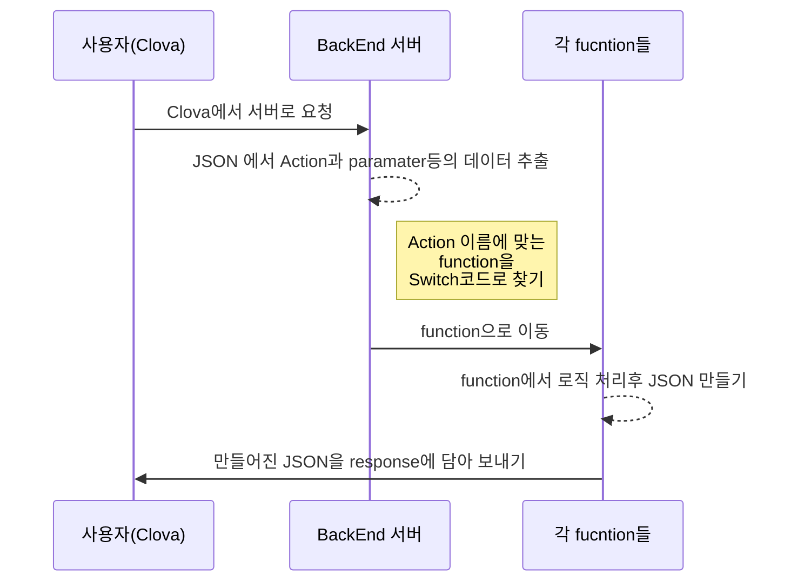

# Policy

Clova용으로 개발된 로또마스터는 특별히 개인정보를 저장하지 않습니다.

# Naver Clova & Line 챗봇 for GCP Cloud Functions용 샘플코드

## 개요

언어는 한국어 입니다.
Clova Extensions Kit와 **Google cloud functions**기능으로 **nodeJS**를 이용해서 만들었습니다.
앱은 기본적으로 로또번호를 생성해 주며 번호 생성후에 사용자의 명령을 기다립니다.
**request npm**으로 나눔로또 api를 이용하여 지정한 회차에 따른 로또번호를 받아오며, 현재회차는 크롤링을 통해서 구현하였습니다.

본 페이지의 샘플코드는 **Google GCP**의 [Cloud Functions](https://cloud.google.com/functions/)에 올릴 수 있게 만들어진 샘플코드 입니다. 여기서는 로또 당첨 번호를 조회하는 챗봇으로 설명을 합니다. 설명하는 코드를 위해서 만든 챗봇이 **로또번호 조회**인 이유는 다음과 같습니다.

물론 수학 잘하는 사람은 로또를 하지 않습니다.

* 숫자라는 데이터를 이용한다는 점에서 정형화.
* **API**가 공개돼 있고 특별한 인증키가 필요하지 않음.
* 실생활과 밀접하게 사용 되고 있고, 누구나 알고 있는 서비스. (미성년자는 안되지만...)

이 서비스에서는 **로또번호의 생성**과 **현재 당첨번호**, **이전 회차의 당첨번호**, **로또 교환장소**,**로또번호 생성** 기능을 만들게 됩니다.

챗봇을 만드는 사람이 최대한 이해하기 쉽게 쓰고자 했지만 혹시 어려운 점이 있으면 E-mail을 보내주시면 되겠습니다.

## 특징

이 샘플코드의 특징은 다음과 같습니다.

 1. 이해하기 쉽게 만들었습니다.

남이 짠 코드도 힘든데 새로운 기능도 만들어야 한다면...

일반적인 샘플 코드의 경우 class 를 쓴다던가 하는 고급기술을 쓰거나 아마존 **EC2**(구글에서는 앱엔진)을 써서 파일을 여러개로 분리하는 방식을 사용하고 있습니다. 이 방식이 맞긴 맞지만, 이해하기 어려운 내용이 있습니다. 특히 **기초를 이해해야 다음 단계로 이해**를 하는데, 처음 챗봇을 제작하는 입장에서는 이런점도 어려운 부분입니다. 이를 해결하고자 **한 페이지**로 간단하게 만들었습니다.

 2. 서버 비용 문제 해결

비용의 차이가 느껴지십니까?

개인개발자의 비용을 내고 싶지 않은게 현실입니다. 때문에  [Cloud Functions](https://cloud.google.com/functions/)이나 [Lamda](https://aws.amazon.com/ko/lambda/features/)를 사용하여 올릴 수 있도록 만들게 되었습니다. 저 또한 [Cloud Functions](https://cloud.google.com/functions/)을 자주 사용하는 입장입니다.

## Clova Extensions Kit설정하기

우선 [Clova Extensions Kit](https://developers.naver.com/console/clova/)으로 가서 제작을 해봅시다. **Clova Extensions Kit**은
다음과 같은 형태 중 **대화 인텐트** 인터페이스를 설계하는 곳입니다.

우선 플레이 킷을 만듭니다. [Clova Extensions Kit console](console.Clova Extensions Kit.com/api-client/)에서 계정을 만들고 새로운 이름을 만듭니다.

### 1. Custom Extension 만들기 & 메타데이터 입력

extension 만들기를 누릅니다

* Custom extension과 Chatbot extension차이
> 음악, 쇼핑, 금융 등 다양한 분야의 3rd Party 서비스를 제공하시려면 Custom extension, 간단한 질문 답변이나 FAQ 등은 Chatbot extension을 선택하세요. 추후에 IoT 기기 제어 서비스를 위한 Clova Home extension이 추가될 예정입니다.

저는 그냥 **Custom**으로 개발했습니다.

기본 정보를 등록합니다. 이름은 *단순명사나 물음 형태가 아닌* **2개의 단어의 조합**으로 입력이 되야 하는거 같습니다. 브랜드가 있다면 심사를 거쳐서 등록이 되겠지만, ~~우리와 같은 개인개발자는 그런 권력이 없으니~~ 그냥 적당히 입력합니다.

서버설정을 등록합니다. **Extension Server**는 Cloud functions의 주소를 입력합니다. GCO Cloud functions주소는 인증서가 적용 되 있어서 아무 문제 없이 이용이 가능합니다.

설명대로 입력해줍니다. 왠만하면 일반 설명만 보고 이용방법을 알 수 있게 하는 것도 좋습니다. 그러면 심사용 설명에 사용방법을 쓸 필요가 없으니깐요.

> ※ 아이콘은 Skill Store의 디자인에 맞춰 원형으로 제작해주세요. 아이콘이 사용자에게 어떻게 어떻게 표시되는지 확인하려면 'Clova 앱>설정>스킬 스토어'에서 skill을 선택하세요.

png로 만들면 배경을 투명으로 만들수 있습니다.

1.  **아이콘 이미지는 원형**으로 만들어야 합니다. 저는 **img/icon**에 보시면 **108**과 **512**픽셀로 만들어진 아이콘이 있습니다. 저는 직접 만들었습니다.

2. **Extension 설명**에는 반드시 **고객센터 연락처**를 넣어야 합니다. **메일주소**를 넣으면 됩니다.

기타 **policy주소**를 등록합니다.  **선택사항** 이지만 저는 [기존에 쓰는 페이지](http://stratos.dothome.co.kr/index.html#policy)가 있는 관계로 입력해줍니다. 없으면 **github**에 페이지 하나 만들어서 쓰던가 google document하나 파서 공유하는 형태로 하셔도 될 겁니다.

여기까지가 기본 정보의 등록입니다. 이제 **Custom Extention**을 설정하러 갑시다.

Clova Extensions Kit

이런 형태로 **Clova Extensions Kit DashBoard**가 보일 것입니다. 이제 하나씩 만들어 봅시다.

>

### 2. Custom Extension Intent 만들기

Extension에서는 사용자의 발화를 입력하는 부분입니다. **최소 10개 이상은 넣는게 안전**하다고 봅니다. 최대한 머리를 짜내어(..) 넣어보도록 합시다.

Intent 이름은 name 형식으로 입력을 하였습니다. Clova는 이상하게 '.'을 Intent이름에 입력할 수 없게 설정이 되어 있습니다. **한글 아니면 영어 대소문자** 인거 같네요.

* selectlotto
* nowlotto
* lottochange

총 3가지 가지를 입력 했으며  **Extension Server**연동을 통해서 전부 구현 하였습니다.

 1. selectlotto

특정 회차를 말하면 API를 이용하여 당첨번호와 1등 상금액수 등을 조회하는 기능입니다.

사진과 같은 형태로 입력을 하였습니다. 각 숫자에는 **number**라는 **Built in slot**를 사용하였습니다. **Clova Extensions Kit**에서 **미리 만들어진 Slot**로 사용자가 말한 숫자를 인식하여 **Parameter**로 이용합니다. **Intent를 입력 한 후 숫자를 드래그 해서 Slot적용**을 합니다.

우선 튜토리얼이라 따로 분리를 할까 하다가, 그냥 여기서 Slot을 어떻게 만드는지 부터 설명하겠습니다.

메뉴 왼쪽 하단에 Built-in Slot을 선택합니다.

미리 만들어진 Slot이 있습니다. 네이버 Clova가 만들어놓은 Slot으로 여러 형태가 있으며, 여기서 숫자를 사용해야 하기 때문에 **CLOVA.NUMBER**를 **체크**하고 **저장**합니다.

그리고 Slot을 사용할 **selectlotto**로 갑시다.

하단에 보면 **slot**을 부를 수 있는 부분이 있습니다. 여기서 **Slot**이름을 설정합니다. 저는 **number**로 했습니다. 그리고 **Slot**을 지정해 줍니다.

아까 체크한 Built-in Slot이 보이죠? 이걸 선택합니다.

이로서 Slot설정이 완료 되었습니다. 이제 Slot을 ~~제 마음대로~~ 설정할 수 있게 된 겁니다.

Slot설정이 되었다면 드래그를 하면 사진처럼 뭔가 뜹니다. Slot을 선택하는 부분으로 아까 지정한 이름인 **number**를 선택합니다.

지정을 하면 사진과 같이 됩니다. Slot는 **number**이네요. 이후 **Extension Server**에서 쓰이는 **Parameter**의 이름은 **number**가 되는 것입니다.

나머지  **Intent**에 입력을 하고 나서 **숫자 부분만 드래그** 한후 수동으로 하나하나 slot을 선택해 줘야 합니다.  그리고 저장을 하면 끝.

 2. nowlotto

최근의 로또 당첨번호와 1등상 액수 등을 인식하는 **Intent**입니다. **nowLotto Intent**는 *Slot가 필요 없기* 때문에 **Intent**를 입력하고 저장 하면 끝납니다.

Intent이름을 적절하게 지정하고, 예시 intent를 입력하면 끝입니다.

3. lottochange

로또 교환장소를 알려주는 기능입니다. 여기서는 1등부터 5등까지만 Slot을 만드는 것을 설명하여, custom slot을 구현할까 합니다.

Custom Slot 메뉴로 갑니다.

우선 이름을 지정합니다. lottoNum이로 할까요?

Slot의 결과값을 설정합니다. 1등은 1이니 1을 넣었습니다.
결과값은 Extension Server로 갈때 들어오는 parameter 값이 됩니다. 따라서 구분이 명확한 것을 설정하는게 좋습니다. 유일값이 되니깐요.

동의어에는 1등으로 인식될 값들을 입력합니다. 여기서는 1등 이외엔 없지만 만약 요리가 될 경우 다양한 이름이 입력됩니다. 가령 어묵을 말한다면

> 오뎅, 어묵, 어묵탕, 오뎅탕, 어묵볶음, 오뎅볶음...

이런식으로 **비슷한 음식들의 동의어**를 입력해야 할 겁니다. 또 가상화폐의 경우 발음이 애매한 화폐인 리스크인 경우

> 리스크, 리수쿠, 리스쿠, 리스...

**발음상 비슷한 것**까지 입력을 해줄 필요가 있습니다.

이렇게 1등부터 5등까지 입력을 해줍니다.

그리고 나서 회차별 로또조회때처럼 slot을 부르고, 입력한 intent에 드래그를 해주어 custom slot을 선택합니다.

숫자 부분만 선택하여 입력을 한 결과입니다. 사진처럼 깔끔하게 입력을 하고 저장을 합니다.

4. 사용자 경험을 위한 도움말 기능

사용자 경험을 위해서 어떻게 사용하는지 모르는 사람들을 위해서 도움말 기능이 있으면 좋습니다. 저는 주로 도움말이나 메뉴얼로 어떤 기능을 하는지 넣습니다. 그리고 지원되는 커멘드 소개를 따로 분리를 하였습니다.

## Extension Server 로직 구조

 1. 사용자가 말한 내용을 **Clova Extensions**이 처리를 하여 적절한 Intent를 찾습니다. Intent는 연결된 Action을 찾아 설정된 방식으로 **BackEnd** 서버에 **Request서버에 JSON**을 보냅니다.

 2. 서버에는 들어온 **JSON을 분해**하여 *Action*이름과 *Parameter*를 받습니다. *Parameter는 나중에 각  function에서 사용*하게 됩니다.

 3.  하단의 Switch 문에서 *Action이름으로 설정된 function*을 찾아 작동을 합니다.

 4. function에서 데이터를 처리합니다. 만약 **Parameter**를 사용한다면 미리 파싱한 **Parameter**를 이용하여 값(Value)를 찾아 사용을 하면 됩니다.

 5. 처리된 값을 **JSON**으로 만들어주고 **Response**에 싣어서 보냅니다.

## 코드 설명

이제부터 Extension Server를 해야 합니다

코드의 설명에 있어서 로또번호를 생성하는 부분을 예시로 설명하겠습니다.

### JSON 분석

	{
    "version": "0.1.0",
    "session": {
        "sessionId": "5e83e1ae-b1e1-4d65-92b3-34f3e3bc0978",
        "sessionAttributes": {},
        "user": {
            "userId": "5jozVEqwR0mLzY7R2NmpxQ",
            "accessToken": "c5fad13e-74cc-4e01-9a53-14cb3ce2a288"
        },
        "new": true
    },
    "context": {
        "System": {
            "application": {
                "applicationId": "com.lunastratos.lotto"
            },
            "user": {
                "userId": "5jozVEqwR0mLzY7R2NmpxQ",
                "accessToken": "c5fad13e-74cc-4e01-9a53-14cb3ce2a288"
            },
            "device": {
                "deviceId": "45056241-0b2f-4f66-b285-6887922113fa",
                "display": {
                    "size": "l100",
                    "orientation": "landscape",
                    "dpi": 96,
                    "contentLayer": {
                        "width": 640,
                        "height": 360
                    }
                }
            }
        }
    },
    "request": {
        "type": "IntentRequest",
        "intent": {
            "name": "selectlotto",
            "slots": {
                "number": {
                    "name": "number",
                    "value": "800"
                }
            }
        }
    }
}

 Request하면 이런 식으로 들어옵니다.

처음으로 오는 부분은 **Request의 body를 분석**해야 합니다. 여기에 Clova에서 오는 **Request**가 오며 이 부분에 주요 **JSON**이 있습니다. 다음은 **Request**가 오는 예시입니다.

    //request
	  const requests = req.body.request;
	  //context
	  const contexts = req.body.context;
	  //newComer : 이걸 이용하면 방문한 사람이면 실행시 설명 생략 가능.
	  const newComer = sessions.new; //true or false
	  //intent Type
	  const intentsType = requests.type;
	  //intent 이름: Extension에서 설정한 이름입니다.
	  const intentName = requests.intent.name;

이중에 특징적인 것만 보면

*  **requests** : slot이나 intent이름등이 들어 있습니다.
*  **newComer** : 처음 사용한 사람인지 아닌지를 알수 있습니다.
*  **intentName** :   **Clova Extension**에서 지정한 **intent**이름을 얻을 수 있습니다.

이렇게 미리 파싱을 하는 이유는 function안에서 사용시 더욱 편하게 사용하기 위해서 입니다. slot은 slot을 사용하는 부분에서 파싱을 할 예정입니다.

### 1차& 2차 Switch 부분

* 1차 스위치 부분
    //type name
  const LAUNCH_REQUEST = 'LaunchRequest';
  const INTENT_REQUEST = 'IntentRequest';
  const SESSION_ENDED_REQUEST = 'SessionEndedRequest';
  // Intent가 오는 부분
  switch (intentsType) {
    //최초 실행시 오는 intent. LaunchRequest만 쓴다.
    case LAUNCH_REQUEST:
       launchRequest()
       break;
      //일반적인 INTENT_REQUEST의 경우 하위 function에서 switch로 intent를 처리합니다.
    case INTENT_REQUEST:
       intent_select()
       break;
      //종료 기능
    case SESSION_ENDED_REQUEST:
       SessionEndedRequest()
       break;
  } //switch requests.type

**intentsType**을 이용하여 1차적으로 분리를 합니다. 여기서는 챗봇이 시작과 종료 그리고 기능, 3가지로 분리를 합니다.

* 1차 스위치 부분

*  **LAUNCH_REQUEST** :  처음 시작시 실행되는 **type**입니다.
*  **INTENT_REQUEST** :  custom이나 built-in으로 만들어진 intent들이 들어오는 부분으로, **type**명이 **IntentRequest**입니다.
*  **SESSION_ENDED_REQUEST** :  종료시 들어오는 **type** 명입니다.

**IntentRequest**가 들어왔다면 2차 switch에서 분리를 합니다.

* 2차 Switch 부분

실질적으로 기능들이 실행되는 곳입니다. 지정한 이름으로 case를 분리합니다.

	function intent_select() {
    switch (intentName) {
      case 'nowlotto': // 최신 로또번호
        nowlotto_function();
        break;
      case 'makelotto': //로또번호 생성
        makelotto_function();
        break;
      case 'selectlotto': // 선택회차 로또번호
        selectlotto_function();
        break;
      case 'lottochange': // 로또 등수별 교환장소
        lottochange_function();
        break;

        //도움말 부분
      case 'Clova.GuideIntent':
        guide_func();
        break;
      // 종료로 생각되는 발화가 일부 먹히지 않은 관계로 수작업 처리
      case 'exit':
        SessionEndedRequest();
        break;
      default:
        fallback();
    }
    }

**Clova.GuideIntent**의 경우 내장된 **built-in intent**로서 제가 만든 것이 아닙니다. 이 부분에는 설명을 넣었습니다.

**exit**는 일부 종료라고 생각되는 발화가 **fallback**으로 처리가 되는 것이 있어서 만든 intent입니다. **exit intent**로 연결되면 바로 종료가 됩니다.

**default:**는 나머지 **built-in intent**를 처리하기 위한 부분입니다. 로또 마스터에서는 필요하지 않은 기능이기 때문에 **dafault**로 모두 처리를 하였습니다.

### function설명

*  **nowlotto_function**
현재 회차의 로또번호와 상금을 조회합니다. **cheerio**를 이용하여 웹 페이지에 대한 크롤링을 사용하였습니다.
>크롤링: 웹 페이지를 그대로 가져와서 거기서 데이터를 추출해 내는 행위

*  **selectlotto_function**
회차별 로또번호와 상금을 조회합니다. **built-in slot**을 사용하는 부분으로 숫자를 얻습니다.
**request**를 이용하여 **JSON**을 요청, 파싱하여 데이터 얻습니다.

*  **lottochange_function**
등수별 교환장소를 알려줍니다. **custom slot**을 사용하는 부분으로 1등부터 5등까지 말하면 숫자를 slot에서 얻어옵니다. 내부 switch로 텍스트를 완성합니다.

*  **makelotto_function**

로또번호를 생성하는 기능입니다. 생성 로직은 function으로 분리가 되어 있습니다.

> 기존에는 로또 API에서 현재회차 조회가 가능했지만, 6개월 전쯤부터 회차를 지정하지 않으면 에러가 나왔습니다. 그래서 웹 크롤링을 통해서 구현을 하게 되었습니다. 이런류의 로직은 request npm module을 통해서 구현할수 있으며, 이는 [레퍼런스 문서](https://www.npmjs.com/package/request)를 참조하시기 바랍니다.

### makeJson

	function makeJson(str, endField) {
    let JsonField = {
      "version": "0.1.0",
      "sessionAttributes": {},
      "response": {
        "outputSpeech": {
          "type": "SimpleSpeech",
          "values": {
            "type": "PlainText",
            "lang": "ko",
            "value": str
          }
        },
        "card": {},
        "directives": [],
        "shouldEndSession": endField
      }
    };
    return res.send(JsonField);
	}

**makeJson**은 **Response Json**의 생성을 담당하는 부분입니다. 여기서 만들어진 **텍스트인 str**과, 챗봇을 끝낼지를 설정하는 **endField(boolean)**을 받아 json에 설정을 합니다.

> return res.send(JsonField);

 **Response**에 넣어주고 끝내기 때문에 makeJson(str,boolean)만 해주면 됩니다.

### nowlotto_function (현재회차 조회)

> request와 크롤링 부분은 설명을 생략합니다.

	function nowlotto_function() {
    console.log('nowlotto_function')
    const Endfiled = false;

    return asyncTask(0)
      .then(function(items) {
        //여기서 서버연결후 데이터 출력 items으로 가져옴
        let returnValue = items.returnValue; // success or fail
        let displayText = '';
        if (returnValue == "fail") { // 서버접속 실패 혹은 200에러 등
          //현재회차의 경우 에러가 나는 일은 없습니다.
          displayText = '죄송합니다. 일시적인 에러가 발생하였습니다. 한번 더 말해주세요.'
        } else { // 서버가 에러가 나지 않는다면
          let firstWinAmount = items.firstWinamnt; // 1등상 액수
          let firstPrizeHuman = items.firstPrzwnerCo; // 총 인원
          let rawDate = items.drwNoDate; // 당첨날짜

          //...중간로직 생략

        }
        makeJson(displayText, Endfiled);
      });
	  } // nowlotto_function

intent가 들어오면 function이 작동합니다.

코드 자체는 json으로 만들어진 데이터를 분리하고 텍스트를 만드는 부분입니다. 다 만들어진 Text를 **makeJson**에 넣어주면 됩니다.

### selectlotto (특정회차 조회)

> request의 api요청 부분은 설명을 생략합니다.

	function selectlotto_function() {
    console.log('selectlotto_function')
    const Endfiled = false;
    let displayText = '';

    //slot에 있는 회차번호 가져오기
    const selectNum = parseInt(requests.intent.slots.number.value);

    return asyncTask(selectNum)
      .then(function(items) {
        console.log(items)
        //여기서 서버연결후 데이터 출력 items으로 가져옴
        let returnValue = items.returnValue; // success or fail

        if (returnValue == "fail") { // 서버접속 실패 혹은 200에러 등
          displayText = "아직 진행되지 않은 로또회차이거나 서버에러 등으로 서비스를 제공할 수 없었습니다. 다른 회차를 말해주세요.";

        } else { // 서버가 움직인다면
          let firstWinAmount = items.firstWinamnt; // 1등상 액수
          let firstPrizeHuman = items.firstPrzwnerCo; // 총 인원
          let rawDate = items.drwNoDate; // 당첨날짜

         //중간 로직 생략

        makeJson(displayText, Endfiled);

      });
	  } // selectLottoNum_function

특정회차를 조회할때 **number** 라는 이름의 **Slot**을 만들었습니다. 이 이름으로 value를 받아서 숫자를 받는 것입니다.

    const selectNum = parseInt(requests.intent.slots.number.value);

이를 통해서 숫자를 얻고 이를 **request**모듈로 보내어 **API**와 접속을 합니다. **JSON**을 받아오게 되고 처리를 합니다. 그리고 **makeJson**으로 넘기는 과정입니다.

### makelotto (로또번호 생성)

	  function makelotto_function() {
    const getLottoMakeArray = makeLotto();
    const Endfiled = false;
    let displayText = '제가 생성한 로또번호는 ' + getLottoMakeArray[0] + ', ' + getLottoMakeArray[1] + ', ' + getLottoMakeArray[2] + ', ' + getLottoMakeArray[3] + ', ' + getLottoMakeArray[4] + ', ' + getLottoMakeArray[5] + ', 입니다. ' + shuffle(lastTextArr)[0]
	    makeJson(displayText, Endfiled);
	  }

### lottochange (로또 교환장소)

custom slot으로 1등부터 5등까지 만든 적이 있습니다. 그 slot을 사용하는 부분입니다.

	const Endfiled = false;
    const selectNum = parseInt(requests.intent.slots.lottoNum.value);

    let displayText = '';

    switch (selectNum) {
      case 1:
        displayText = '혹시 1등이신가요? 1등은 신분증을 가지고 농협은행 본점에서만 수령이 가능합니다.';
        break;
      case 2:
        displayText = '2등은 신분증을 가지고 지역농협을 제외한 농협은행 영업점에서 당첨금을 수령하시면 됩니다.';
        break;
      case 3:
        displayText = '3등은 신분증을 가지고 지역농협을 제외한 농협은행 영업점에서 당첨금을 수령하시면 됩니다.';
        break;
      case 4:
        displayText = '4등은 5만원입니다. 복권 판매점에서 교환하면 됩니다. ';
        break;
      case 5:
        displayText = '5등은 5천원! 복권 판매점에서 교환하면 됩니다. ';
        break;
      default:
        displayText = '그런 상은 존재하지 않습니다. 로또는 1등부터 5등까지만 있답니다. ';
    }

    /**
     * shuffle(lastTextArr[0])는 사용자경험을 위한 모듈입니다.
     */

    makeJson(displayText + shuffle(lastTextArr)[0], Endfiled);

	  } //lottoChange_function

**requests.intent.slots.lottoNum.value**으로 숫자를 읽어서 **Switch**로 텍스트를 완성하는 형태입니다. makeJson은 위에서 설명했으니 생략.

## 자 그럼 실제로 동작하는 지 살펴볼까요?

미리 테스트를 할 수 있습니다. 또한 **클로버 스피커**가 없어도 **개발계정이 연동**된 앱으로 테스트가 가능합니다.

메타데이터 등록때 네이버 계정으로 테스트연동이 가능합니다.

시간이 쪼매 걸립니다

먼저 테스트를 위해서 빌드하기를 눌러줍니다. 이상하게 이 과정에서 시간이 좀 걸립니다. 한 6분 정도 걸린거 같은데... 어디 편의점 다녀올때 하시길 추천합니다.

* 선택회차 조회 결과

	{
    "version": "0.1.0",
    "sessionAttributes": {},
    "response": {
        "outputSpeech": {
            "type": "SimpleSpeech",
            "values": {
                "type": "PlainText",
                "lang": "ko",
                "value": "2018년 3월 31일의 800회차 로또번호는 1, 4, 10, 12, 28, 45 보너스 번호는 26 입니다. 1등상은 11명이 당첨되었으며 액수는 1인당 1,632,246,205원 입니다."
            }
        },
        "card": {},
        "directives": [],
        "shouldEndSession": false
    }
}

잘됩니다.

다 되면 심사신청을 합니다.

> ※ 심사 요청전 아래 자주 거절되는 항목들에 대해 다시 한번 확인해주세요. 심사 거절시 재승인까지 최소 1~2주 기간은 기다리셔야 합니다.  
(1) 아이콘 디자인을 가이드에 맞춰 제작했는지 (512 x 512 픽셀, 원형에 흰색이 아닌 배경색 적용)  
(2) Skill Store용 발화 문장으로 정리된 3문장이 스피커에서 정확히 작동하는지  
(3) Skill Store용 설명에 고객센터 연락처가 들어가 있는지  
(4) Extension 서버 주소가 정확한지 (예: 개발서버 주소)  
(5) 계정 연동시 설정 항목이 정확한지

다음과 같은 주의사항을 읽고 빠진게 있는지 확인!

## 이 샘플코드에 대해서 궁금한 점이 있으신가요?

이메일은 언제나 환영합니다. 어렵지만 않은 내용이면...

언제든지 **Dev.LunaStratos@gmail** 으로 이메일을 보내주시면 됩니다.

## 저작권

Response json를 제외한 부분은 **MIT License**를 따릅니다.
